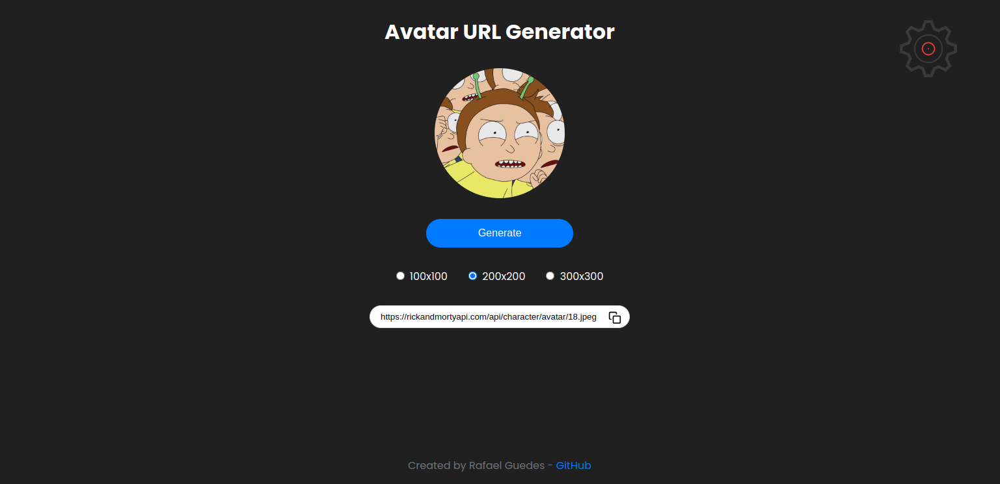

# Avatar URL Generator 👥

    
    

 

 

This is a simple Avatar URL Generator built with React. It uses the [Rick and Morty API](https://rickandmortyapi.com/api/character) to generate random avatars.

## Features

- Generate random avatars from the Rick and Morty API
- Choose the size of the avatar (200x200, 300x300, 400x400, 500x500)
- Copy the avatar URL to clipboard

## Installation

1. Clone the repository: `git clone https://github.com/yourusername/avatargenerator.git`
2. Install the dependencies: `npm install`
3. Start the application: `npm run dev`

## Usage

Click the "Generate" button to generate a new avatar. Choose the size of the avatar by selecting one of the radio buttons. Click the copy button to copy the avatar URL to your clipboard.